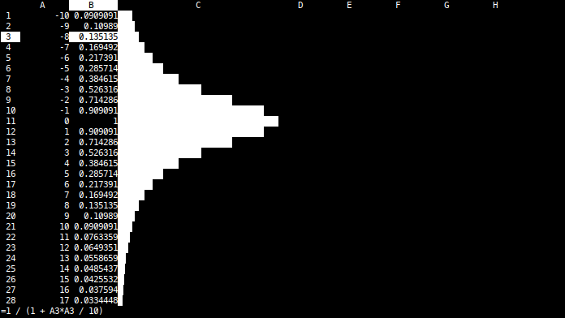

This is a terminal-based spreadsheet that aims to feel familiar for people
knowing excel.

The data is stored in simple CSV files. Consequently, formatting (e.g.
left/right alignment or cell width) is not stored. The sheet can either be
saved in source form (including formulas) or in evaluated form. A source file
can also be evaluated without using the TUI by using the `--eval` command line
option.

## Key bindings

-   Arrow keys and page up/down move the cursor
-   Enter will start full edit mode. `-`, `=` or a digit will start quick edit
    mode. The difference between the two modes is the behavior of arrow keys:
    In full edit mode, arrow keys move the text cursor. In quick edit mode,
    arrow keys move the cell cursor (after submitting the changes).
-   `#` - Start drag mode (blue). Move the cursor to a different cell and press
    enter. The area between the two cells will be filled with the formula from
    the first cell. References to rows and columns that are not prefixed with
    `$` will be adapted.
-   Delete - clear the current cell
-   `>`/`<` - increase/decrease the width of the current column
-   `w` - Write the sheet to a file (source form).
-   `W` - Write the sheet to a file (evaluated form).
-   `q` - show help
-   `q` - quit

## Formulas

Cells can have the following values:

-   Integer (e.g. `1`)
-   Float (e.g. `1.2`)
-   String (e.g. `"foo"`)
-   Formula (e.g. `=A1 + 1`)

Formulas can contains the following functions:

-   `sum(A1:B2)` - calculate the sum of all fields from the given range
-   `bar(A1)` - draw a bar for a value between 0 and 1

## Prior art

-   [sc](http://www.ibiblio.org/pub/Linux/apps/financial/spreadsheet/!INDEX.html) - spreadsheet calculator
-   [visidata](https://www.visidata.org/) - interactivly explore tabular data
